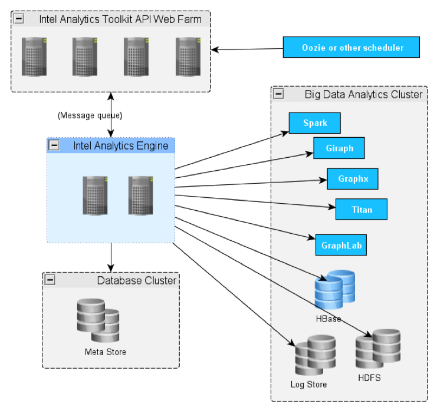
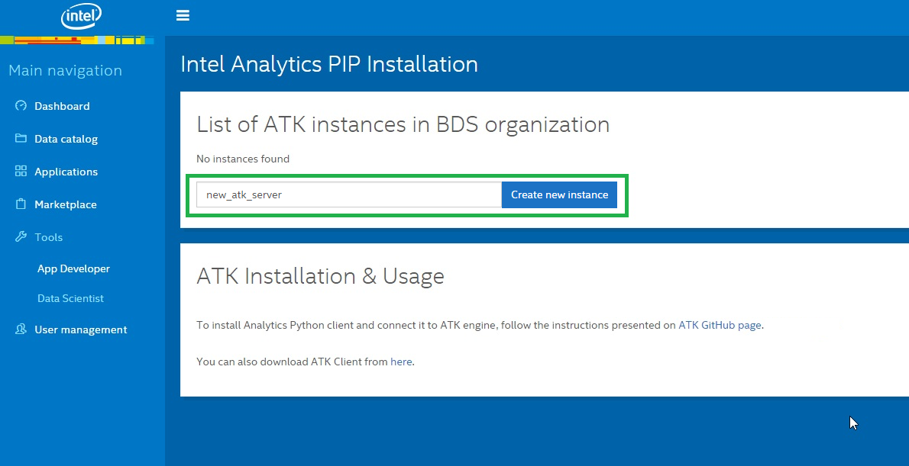
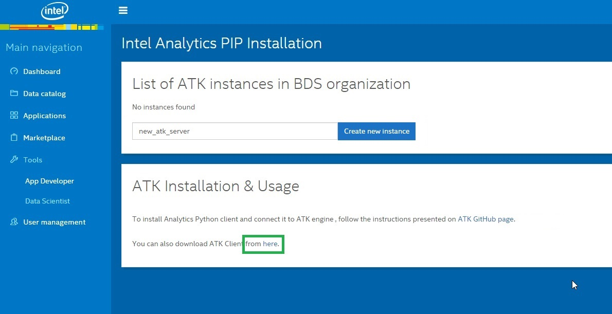

# ATK Overview

> Extensible API for ETL, feature engineering, graph building and query, ML analytics with deep programming language integration

## Overview 

* Python package for data scientists:
    - Makes Big Data easier to use.
* REST web service:
    - Protects clients from needing to know details of the Big Data services being used.
* Processing engine:
    - Coordinates, executes, monitors, audits.
    - Implements all the analytics and machine learning.

## API functionality 

* Operations on tabular data:
    - Import from HDFS files.
    - Add/remove columns, impute missing values.
    - Filter, join.
    - Machine learning. 
* Operations on graphical data:
    - Load from tabular data frames.
    - Query. 
    - Machine learning.

## Client installation configuration and usage

### Creating a toolkit server instance

You can create an Intel® Analytics Toolkit for Apache Hadoop* software server directly from Data Scientist View in the Console. Just type the desired toolkit server instance name and click the _Create new instance_ button. 

### Installation on Windows*

9. To use the toolkit Python client on a Windows computer, you will need to install the Anaconda Python distribution. You can install this software through an msi, which can be found on the Anaconda download page.

9. Before installing the toolkit Python client, you must first install NumPy and Pandas through Anaconda. Open a command line terminal and run the following command:

    `$ pip install --extra-index-url http://host.gao.intel.com/pypi/master/simple intelanalytics`

    All the dependencies for the Intel® Analytics Toolkit for Apache Hadoop* software package will be installed automatically.

### Installation on Linux*

9. You will need Python 2.7 and pip installed before you can install the toolkit client.

9. After installing Python 2.7 and pip, run the following command to install the toolkit client:

    `$ pip install --extra-index-url http://host.gao.intel.com/pypi/master/simple intelanalytics`

### Download the toolkit client on the platform

9. You can create an Intel® Analytics Toolkit for Apache Hadoop* software client directly from Data Scientist View in the Console.
     

9. Once it is downloaded, you can install it with the following command:

    `pip install ./intelanalytics-{VERSION}.tar.gz`

Note that the toolkit client delivered here may be not the latest version.
(Update requires rebuild of file-server service.) 

### Configuration
After the installation of the toolkit Python client, you must [configure it to connect](https://github.com/trustedanalytics/atk/wiki/python-client) to the desired REST server.

