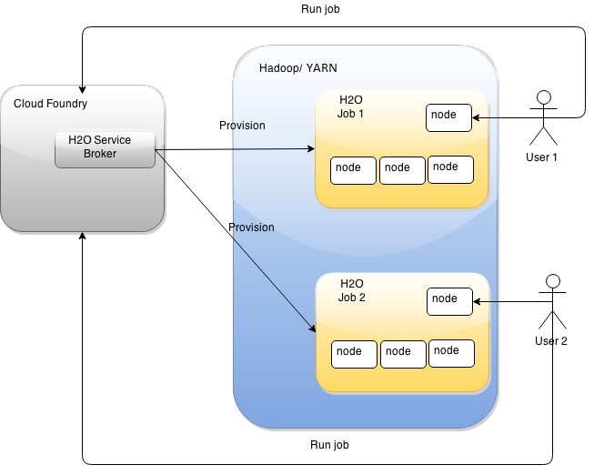
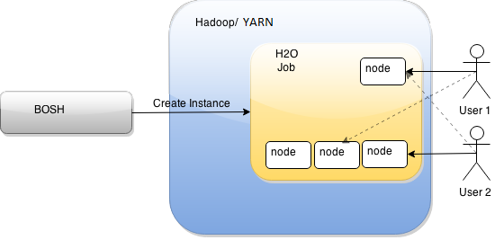
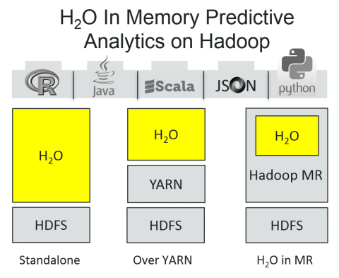

# H2O integration on the platform

H2O is designed to be used by a single person at a time. All entities are kept in memory and the user must explicitly save to HDFS. This method is intuitive, but it is unfortunately not well suited for Cloud environments. This topic analyzes different options we have in order to make a use of H2O in the platform.

## On-demand

We can create a Service Broker, which users can use to run their own H2O jobs.
In this case, we have full security of data. User access rights are passed to H2O and used consequently.



### Limitations
1. The major downside of this method is a high-memory footprint. All jobs run on YARN and consume memory even if the user doesn't make any calculations.

    There's no possibility to downsize unused-job instances dynamically. They are controlled by YARN and can be defined only at startup.

1. In extreme situations, YARN may have not enough resources to even start an H2O job for a user.

1. Users cannot easily share their intermediary work. Everything they want to share with other users has to be serialized on HDFS.

### Multitenancy

Instead of running one H2O job per user, we can run one and allow for concurrent use.
Several users can work on the same job instance, but they have to be careful, because all the models and data frames in memory are shared.
 


#### Limitations

9. There's no isolation between different users' work.

9. Users can overwrite or remove other users' models and data frames in memory.

9. The same can be said about entities saved on HDFS: A single job acts as a single HDFS user, which implies that H2O users can easily overwrite each other files.

9. Every user can easily shut down a cluster using UI. This makes cluster installation very fragile.

Multitenancy can work for small teams that work together, but it's definitely not a solution for a public installation.

### Hybrid solution
On-demand and multitenant at once. Part of YARN cluster dedicated to multitenant solution and part dedicated to individual on demand H2O jobs.

## Installation
H2O can be installed in three different ways:



9. In **Standalone** mode, you have to provide hosts and install H2O manually. 
  
9. **Over YARN** means you must run H2O as a job on YARN, which takes care of provisioning processes in containers. 

9. If your Hadoop doesn't have YARN, you can always install **H2O in MapReduce** 1.0 framework.

The best option is to install H2O over YARN.

H2O is started as a typical YARN job by using  the _hadoop jar_ command from the local host. For this to work, you will need:

* Network access to the Hadoop cluster (from/to each datanode, YARN resource manager),
* Hadoop client installed and configured properly (set HADOOP_CONF_DIR environment variable). 

### Requirements
 
* Java version 1.6 or later
* Hadoop Cluster (for example CDH 5)
* YARN datanodes have to be able to communicate using both **tcp** and **udp**, because H2O nodes use these protocols to establish and manage the cluster. 
  [(Details)](https://github.com/h2oai/h2o/wiki/Network-and-H2O-cloud-specification-when-creating-tests).  
   
### Installation
  
To install, download and unzip file with latest stable version of H2O binary.
For example:

```
 wget http://h2o-release.s3.amazonaws.com/h2o/rel-nunes/2/h2o-2.8.6.2.zip
 unzip h2o-2.8.6.2.zip
```
 
## Starting an H2O cluster

First run the H2O driver. The driver supervises the cluster process and dies immediately (when option -disown is set):
 
```
 cd h2o-2.8.6.2 
 hadoop jar hadoop/h2odriver_cdh5.jar water.hadoop.h2odriver -libjars h2o.jar -mapperXmx 512m -nodes 4 -output /hdfs/path/ -notify h2o_ui -disown
```
What happens:

9. Four-node H2O cluster is started. Each node reserves 1 gigabyte of RAM for data and computation (-mapperXmx 1g). 

9. H2O driver creates a directory on HDFS (-output /hdfs/path/). If the directory with a given name already exists, the driver will return an error. 
    If everything goes well, an output similar to the following appears in the terminal window:

```
Determining driver host interface for mapper->driver callback...
    [Possible callback IP address: 10.10.0.171]
    [Possible callback IP address: 127.0.0.1]
Using mapper->driver callback IP address and port: 10.10.0.171:35243
(You can override these with _-driverif_ and _-driverport_.)
Driver program compiled with MapReduce V2 (YARN)
15/05/06 04:48:19 INFO Configuration.deprecation: mapred.map.child.java.opts is deprecated. Instead, use mapreduce.map.java.opts
Memory Settings:
    mapred.child.java.opts:      -Xms512m -Xmx512m
    mapred.map.child.java.opts:  -Xms512m -Xmx512m
    Extra memory percent:        10
    mapreduce.map.memory.mb:     563
15/05/06 04:48:19 INFO Configuration.deprecation: mapred.used.genericoptionsparser is deprecated. Instead, use mapreduce.client.genericoptionsparser.used
15/05/06 04:48:19 INFO Configuration.deprecation: mapred.map.tasks.speculative.execution is deprecated. Instead, use mapreduce.map.speculative
15/05/06 04:48:19 INFO Configuration.deprecation: mapred.map.max.attempts is deprecated. Instead, use mapreduce.map.maxattempts
15/05/06 04:48:19 INFO Configuration.deprecation: mapred.job.reuse.jvm.num.tasks is deprecated. Instead, use mapreduce.job.jvm.numtasks
Job name 'H2O_84379' submitted
JobTracker job ID is 'job_1428512036633_0042'
For YARN users, the logs command is 'yarn logs -applicationId application_1428512036633_0042'
Waiting for H2O cluster to come up...
H2O node 10.10.10.217:54321 requested flatfile
H2O node 10.10.10.33:54321 requested flatfile
H2O node 10.10.10.40:54321 requested flatfile
H2O node 10.10.10.37:54321 requested flatfile
Sending flatfiles to nodes...
    [Sending flatfile to node 10.10.10.217:54321]
    [Sending flatfile to node 10.10.10.33:54321]
    [Sending flatfile to node 10.10.10.40:54321]
    [Sending flatfile to node 10.10.10.37:54321]
H2O node 10.10.10.40:54321 reports H2O cluster size 1
H2O node 10.10.10.217:54321 reports H2O cluster size 1
H2O node 10.10.10.37:54321 reports H2O cluster size 1
H2O node 10.10.10.33:54321 reports H2O cluster size 1
H2O node 10.10.10.33:54321 reports H2O cluster size 4
Cluster notification file (h2o_ui) created.
H2O cluster (4 nodes) is up
```

H2O nodes can communicate with each other by means of multicast or UDP to establish the cluster. Multicast is not an option in AWS, so we're using UDP transport.


## Usage
After a cluster is started, a user can perform analytic and management tasks using one of the following interfaces.  

### UI
User can use UI from any H2O node, because it's hosted everywhere. Address of one of them will be selected by H2O and written to the notification file (-notify h2o_ui).
This file is located in working directory from which H2O has been started.
[(Details)](http://docs.h2o.ai/h2oclassic/deployment/hadoop_tutorial.html)

How it works may be a bit problematic. When a node that a user is working on goes down, there's no information how to connect to another one.

If you decide to use H2O as a long-running multitenant installation, the possibility of node failure will increase and that problem will be even bigger.


### REST API
Underneath the UI there's a REST API provided by embedded web server. It can be used directly in automation scripts. 
[(Details)](http://docs.h2o.ai/h2oclassic/developuser/rest.html)

### R client library 
The other option of using H2O is a dedicated R package, available from h2o.ai. It works by issuing commands against REST API.
[(Details)](http://docs.h2o.ai/h2oclassic/developuser/how_r_interacts_with_h2o.html#how-r-expressions-are-sent-to-h2o-for-evaluation)

### Data ingestion into H2O
There's no possibility to upload a data set by REST API directly - a user has to use `hdfs dfs -put` command instead.
Once data set is on HDFS, H2O gets it from there and loads it into memory. However, it is possible to load data **directly to cluster memory** by specifying an external URL to file.

The most convenient way is to use DAS to get data on board, and then show a user an HDFS path that he can use in his scripts, similar to the way it works for the Intel® Analytics Toolkit for Apache Hadoop* software. 

### Managing H2O entities
H2O entities--such as models, data frames, and predictions generated by scoring engines--are kept in memory. There's no persistence of these objects. The user can always see the list of these entities and remove some. If we have two users working on a single H2O job instance, they both can see the same set of entities and can make changes in each other's work.

A user can persist entities to the HDFS file. If the user attempts to overwrite an existing file, H2O will return an error, unless the user selects the _force _option to overwrite the file deliberately. 

H2O reads and writes HDFS files with the rights of the user who started it. If you have an H2O job for exclusive use it can work. If, on the other hand, you'd like to use H2O in multitenant way it could be a real problem.
[(Details)](http://docs.h2o.ai/h2oclassic/userguide/dataexportfiles.html)

## H2O from point of view Hadoop (YARN MapReduce v2)
Running H2O as a Yarn job means that there are resources allocated for it. There's a dedicated parameter for specifying memory limit - `mapperXmx`.
The formula used by the H2O driver to calculate the amount of memory required looks like this: 
```
YARN container size
== mapreduce.map.memory.mb
== mapperXmx + (mapperXmx * extramempercent [default is 10%])
```
[(Details)](http://docs.h2o.ai/h2oclassic/deployment/hadoop_yarn.html)

We highly recommend allocating **four times more memory** than the size of the dataset being processed. Allocated resources (memory and YARN containers) are not returned to YARN until the H2O cluster is shut down, even when there is no computation.
