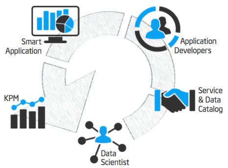

> Trusted Analytics platform provides a fully managed development and a runtime experience for data scientists and developers.

At the highest level, the core functionality of this PaaS is based on five use cases

* [Onboarding as an Operator](Onboarding)
* [Self-service as a Data Scientist](Data Scientist Self-Service)
* [Development as a Data Scientist](Data Scientist Model Development)
* [Publishing as a Data Scientist](Data Scientist Publishing)
* [Provisioning as a Developer](Use of Microservices in App)

> The above are not fully developed yet.The specific use cases will be written up here soon. 
