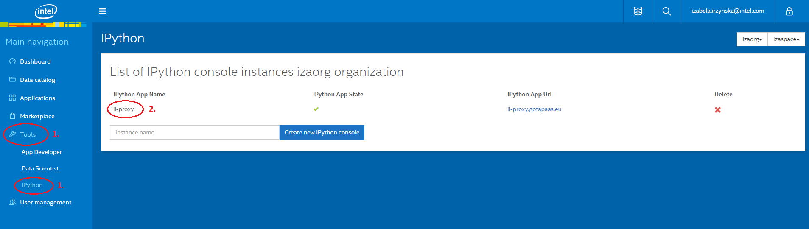
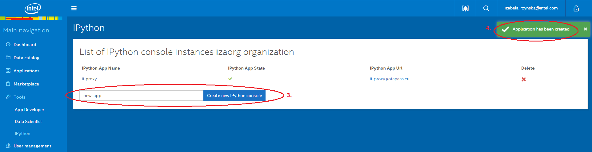
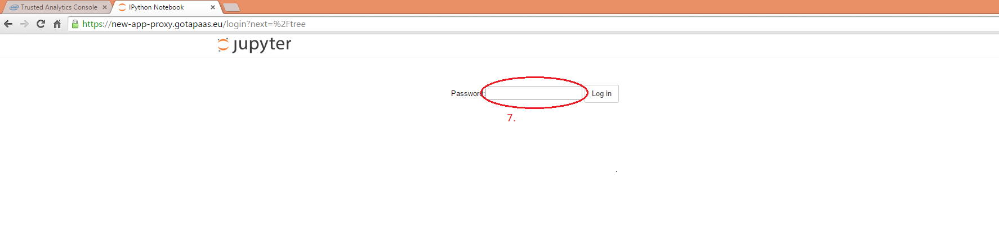
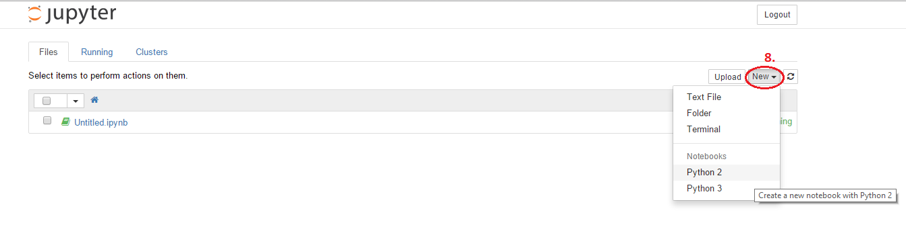

Steps below describe the way how to create and access iPython instance on Trusted Analytics Platform

1. Go to **Tools -> IPython** tab.
1. You will see a list of iPython instances already created (if there is any).

1. To create a new instance write the name of you application and push the button _Create new IPython console_
1. You will get the message that application has been created, but it may still take up to 1 min till the instance will be actually available. 

1. So, refresh the page after few moments and you should see your iPython instance on the list. Please note, that the name of your application changed a bit. There is a word _**-proxy**_ added at the end of the application name. 
1. In the same row you can also find a link where your instance of iPython is accesible. 

1. Once you click on the link provided in 6., your browser will take you to the iPython login website.

1. To get password for your application, you will need to use a terminal. Log in to appropriate Cloud Foundry api endpoint and choose the right target organization and space (the same, where you created iPython instance). 
Access your application environment by typing:
```
$ cf env new_app-proxy
```
In the response, find "ipython" service description in VCAP_SERVICES part and copy password from the "credentials" section:
```
{
 "VCAP_SERVICES": {
  "ipython": [
   {
    "credentials": {
     "hostname": "10.10.5.251",
     "password": "eoz9rg3rpx5qphnl", <-------- PASSWORD TO COPY
     "port": "38406",
     "ports": {
      "8888/tcp": "38406"
     },
     "uri": "https://10.10.5.251:38406"
    },
    "label": "ipython",
    "name": "new_app-ipython",
    "plan": "free",
    "tags": [
     "ipython"
    ]
   }
  ]
 }
}
```

Go back to login website (7.) and paste the password. You should now be able to start using iPython Notebook.
