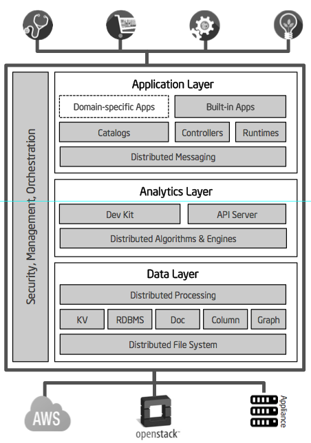

> A Platform-as-a-Service cloud stack for data scientists and application developers to build and operate domain-specific applications driven by data analysis at scale.

# Overview 

# Latest

# Logical components 

 
# Physical components 
 
* [[Data Platform]]
* [[Application Platform]]