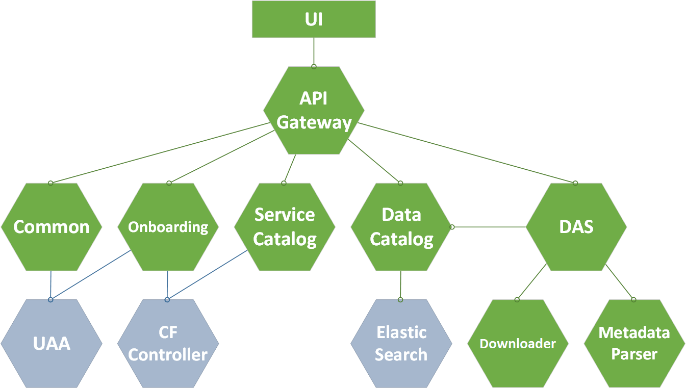

> PaaS user interface

# Architecture

The image below shows the current system architecture. Hexagons represent particular microservices connected via REST interfaces. 

[Source file in Visio](wikiImages/platform-architecture.vsdx)

## UI

The UI is not a service per se and does not reside on the CF environment, so it is presented in a different way outside the system. It is, in fact, an AngularJS application running in the user's browser and communicating with the server side via REST interface.

## API gateway

The API gateway is a proxy between UI and the rest of the services. It handles REST request optimization by gathering data from services below and merging them into one request sent to the UI. This way the client can send a single query per page and avoid cross-origin requests. See more about this pattern [in a document in Google docs](https://docs.google.com/document/d/15G8ew0qEDqpuBTWH9YGHKhda6HaLvfKuS4pnB-CPm50/mobilebasic#h.e75kss1ecf85).

## Use cases

* [[Onboarding]] 

