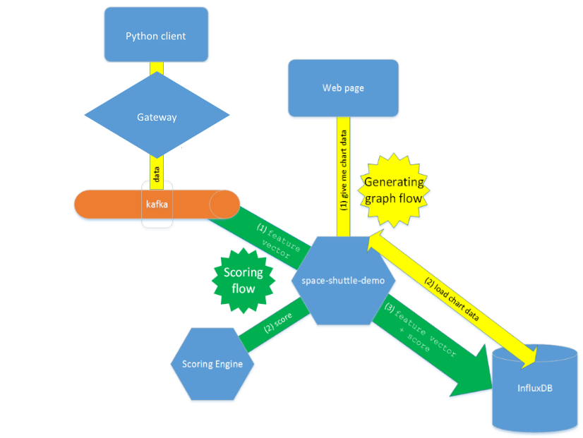

Here you will find a description, how to set up a simple demo application by using some of the platform features. 



Download applications [space-shuttle-demo](https://github.com/trustedanalytics/space-shuttle-demo) and [gateway](https://github.com/trustedanalytics/gateway) from Github.
<p>Use the following command to set your API endpoint, then log on:

```
cf api http://api.{IP address}
``` 

# Creating an instance for Kafka
Go to [http://console.{IP address}](http://console.{IP address}). In Marketplace, find Kafka and create a new instance for it. The instance name may be different from "kafka". 
## Gateway 
Open the _manifest.yml_ file in the gateway application, edit the application's name, and write "go_buildpack" in the _buildpack_ field. Then add the "services" option to this file and put in its kafka instance name to bind this service to the application. The manifest should look like this:

<pre><code> ---
applications:
- name: atk-gateway
  memory: 512MB
  instances: 1
  buildpack: go_buildpack
  services:
    - kafka
  env:
    GATEWAY_TRACE: "false"
    GATEWAY_ACKS: "false"
    VERSION: "0.9.5.0" `
</code></pre>
<p>
<p>If you make changes in the manifest, use the _cf push_ command to push the changes.

## Creating an instance for InfluxDB and Zookeeper

<p>Create a new instance InfluxDB service and Zookeeper in Marketplace. The first service should have the name "space-shuttle-db" and the second "zookeeper".<p>

### Space-shuttle settings
<p>The host name in the _manifest.yml_ file for space-shuttle should be "atk-space-shuttle". Check if the names of the services are the same as the ones you have created. Add to the end of this file the environment variable _TOPIC_. The name of the topic is the same as the gateway in the manifest. <p>
This is an example _manifest.yml_ file for space-shuttle-demo-master:

<pre><code> ---
applications:
- name: atk-space-shuttle
  memory: 512M
  host: atk-space-shuttle
  path: target/space-shuttle-demo-0.0.1-SNAPSHOT.jar
  services:
    - zookeeper
    - space-shuttle-db
  env:
     TOPIC: atk-gateway
</code></pre>

<p>You can deploy an application to Cloud Foundry by running a _cf push_ command. <p>

## Python client running
<p>In the last step, go to _/space-shuttle-demo/src/main/client_ and run client.py
`python client.py wss://atk-gateway.{IP address}/ws shuttle_scale_cut_val.csv `<p>
<p>You should watch out if you copy this command, because the gateway name may be different from yours. Set up a proxy if you need. <p>

## Expected results
<p>Log on to the platform and open _Applications_. You should see Gateway and Space shuttle with URLs on the list of applications. Each link will take you to a page that displays the data from a CSV file on a chart. <p>
