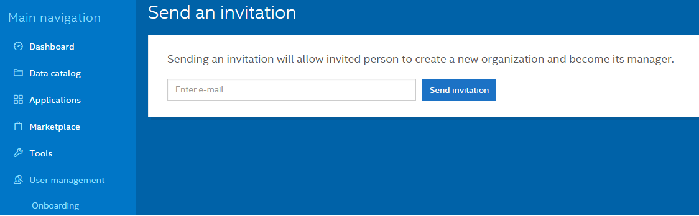

The user interface allows you to invite new people to the platform and add existing users to new organizations or spaces.

To invite a new user to the platform, do the following:

1. Log on to the platform as administrator.

9. Navigate to the <i>User Management > Onboarding</i> tab. 

9. Enter the e-mail address of the user you want to invite and click _Send Invitation_.

Invited users will get an e-mail with a link to the registration page, where they will be able to create their own orgs and specify their personal information.
