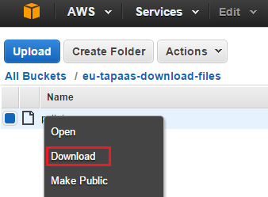
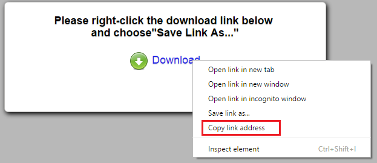
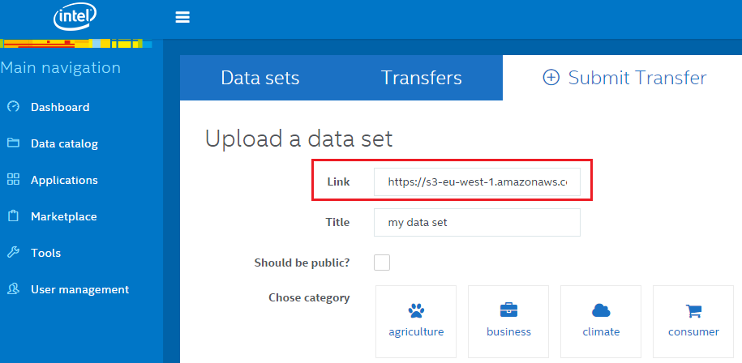

1. Log on to S3 and go into the bucket that contains your file.

9. Right-click your file and select _Download_.

    

9. After clicking download, a popup window should open. Right-click the _Download_ button and choose _Copy link address_.

    

1. Paste this URL into the platform (_Data Catalog > Submit Transfer > Link_). 

    

Notice: This link is only valid for a certain amount of time (usually 3 minutes or less). Transfers can take longer, but you must submit the transfer request within this time.
